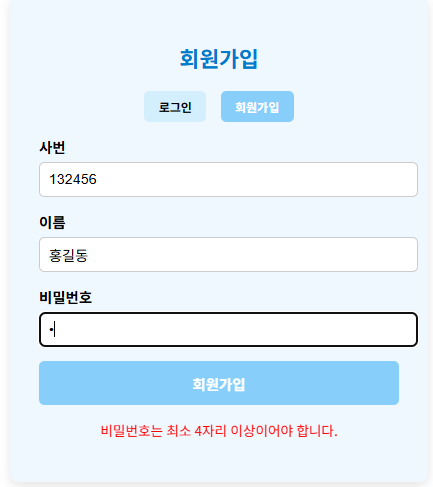
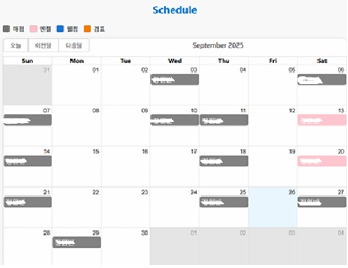
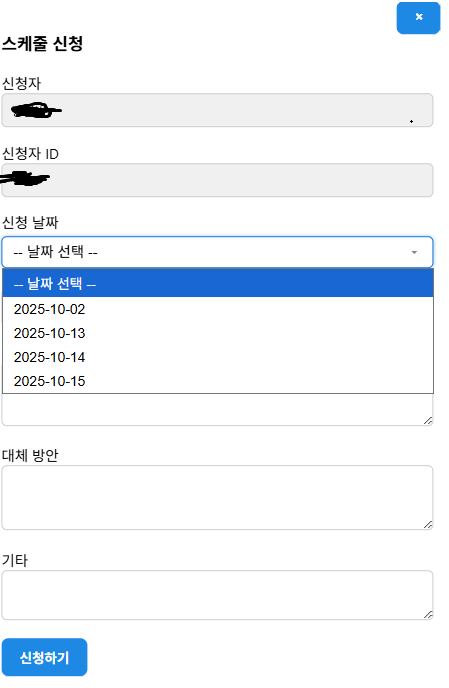

## 이 프로젝트는 현재 쓴이가 일하고 있는 아르바이트에서 아르바이트생을 위한 스케줄러 서비스이다.

### 프로젝트 시작 배경
일하고 있는 아르바이트는 스케줄 근무이기 떄문에, 매주 스케줄이 변경된다. 따라서 고정된 시간에 하는 근무가 아니고 매주 스케줄을 보고 출근하는 형식이다.
아르바이트생들은 스케줄이 올라오면, 스케줄 사진을 보고 출근하며 스케줄 신청은 댓글로 한다. 따라서 이를 잘못보고 출근시간이 헷갈리는 아르바이트생이 다수 발생하며
이는 현장에 막대한 피해를 끼치며, 이로 인해 갈등이 발생하는 것을 다수 확인할 수 있었다. 이러한 배경에서 스케줄 신청과 스케줄 확인을 동시에
해결하기 위해서 본 프로젝트를 시작하게 되었다.

문제를 해결하기 위헤 만든 기능은 다음과 같다.

1. 달력에 로그인한 사용자의 스케줄만 우선적으로 표시 ( 다른 사람의 스케줄을 확인하는 것도 가능)
2. 관리자가 신청가능한 날짜를 지정해두면, 로그인한 사용자는 해당 날짜에 스케줄 신청하는 것이 가능
3. 공지사항의 카테고리화 (매점, 카페, 고객 응대 ...)
4. 아르바이트생들을 위한 월급 계산기

## 프레젝트의 기술 스택
프로젝트의 기술스택은 다음 그림과 같다.

프론트는 react를 사용해서 작성했으며, gpt의 도움을 받아 완성했다. 백엔드는 spring boot를 사용해서 구현했으며, DB인 mysql과 연결헀다.
이러한 구조를 학습의 목적으로 build한 뒤 dockerfile을 사용해, container화 했으며 서버로는 aws ec2를 사용해 구동했다.

## 기능 소개
### 회원가입 및 로그인
회원가입을 할 때는 사용자의 사번과 이름 비밀번호를 입력하도록 했다. 사번을 입력하는 이유는 동명이인의 가능성 때문에 이를 구분하고자 사번을 사용헀다.
사용자는 4자 이상의 비밀번호를 입력하도록 했으며, 그렇지 않은 경우 오류를 일으키며 회원가입이 되지 않도록 구현했다. 사용자가 로그인할 때는 session
방식을 사용헀다.

### 스케줄 확인
로그인에서 session 방식을 사용했기 때문에, 스케줄 확인 역시 session에 저장된 사용자의 사번과 이름을 기준으로해서 달력에 표시된다.
사용자는 달력을 보면 자신의 출근날짜를 한눈에 확인할 수 있으며, 다른 사람의 스케줄도 역시 화면을 클릭에 확인하는 것이 가능하다.
스케줄 등록은 관리자가 하며, 일반 사용자는 스케줄 등록 탭을 확인할 수 없도록 구현했다.

### 스케줄 신청
스케줄 신청은 관리자가 등록한 날짜에만 가능하도록 구현헀다. 로그인한 사용자의 정보가 신청탭에 자동으로 들어가도록 해 기존의 방식과
다르게 편리하게 스케줄 신청하는 것이 가능하도록 구현했다.

### 월급 확인
사용자는 등록된 스케줄을 기반으로, 한달 월급을 계산할 수 있다. 기본 시급, 주휴 수당, 야간 수당, 휴일 수당을 고려해 계산하며, 실제 운영했을 때, +-10만원 정도의 오차가
발생했지만, 큰 오류는 없었다. 계산 로직은 매니저들마다 얘기가 다르기 때문에 이는 참고용으로 확인하도록 안내했다.

## 기술 소개
학습을 위해 memory,jpa 관련된 파일도 존재하지만, 실제 운용에는 jdbc를 사용했다.
### 회원가입 및 로그인
DB의 member table에 **JDBCMemberInfoRepository repositoy**를 사용해서 접근한다. 사용자가 회원가입 및 로그인할 때, member
테이블에 접근해서 데이터를 읽거나 쓰는 역할을 수행하도록 했다.

