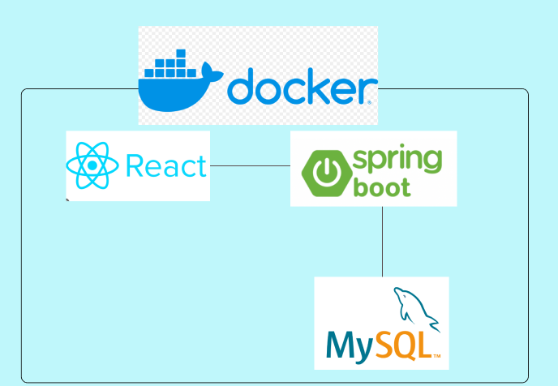
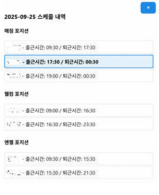
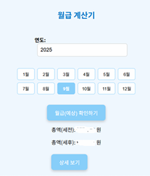
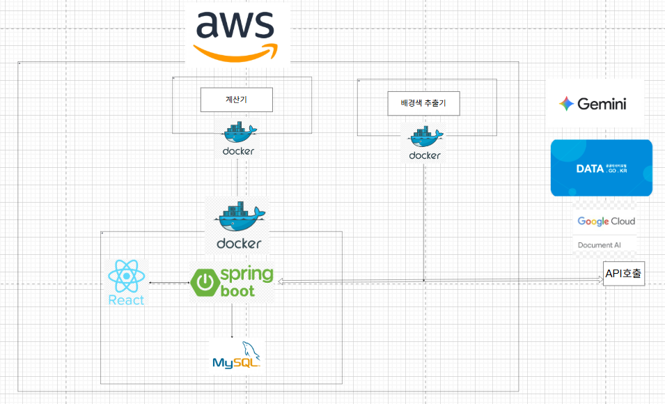

## 이 프로젝트는 현재 쓴이가 일하고 있는 아르바이트에서 아르바이트생을 위한 스케줄러 서비스이다.

### 프로젝트 시작 배경

일하고 있는 아르바이트는 스케줄 근무이기 떄문에, 매주 스케줄이 변경된다. 따라서 고정된 시간에 하는 근무가 아니고 매주 스케줄을 보고 출근하는 형식이다.
아르바이트생들은 스케줄이 올라오면, 스케줄 사진을 보고 출근하며 스케줄 신청은 댓글로 한다. 따라서 이를 잘못보고 출근시간이 헷갈리는 아르바이트생이 다수 발생하며
이는 현장에 막대한 피해를 끼치며, 이로 인해 갈등이 발생하는 것을 다수 확인할 수 있었다. 이러한 배경에서 스케줄 신청과 스케줄 확인을 동시에
해결하기 위해서 본 프로젝트를 시작하게 되었다.

문제를 해결하기 위헤 만든 기능은 다음과 같다.

1. 달력에 로그인한 사용자의 스케줄만 우선적으로 표시 ( 다른 사람의 스케줄을 확인하는 것도 가능)
2. 관리자가 신청가능한 날짜를 지정해두면, 로그인한 사용자는 해당 날짜에 스케줄 신청하는 것이 가능
3. 공지사항의 카테고리화 (매점, 카페, 고객 응대 ...)
4. 아르바이트생들을 위한 월급 계산기

## 프레젝트의 기술 스택

프로젝트의 기술스택은 다음 그림과 같다.

프론트는 react를 사용해서 작성했으며, gpt의 도움을 받아 완성했다. 백엔드는 spring boot를 사용해서 구현했으며, DB인 mysql과 연결헀다.
이러한 구조를 학습의 목적으로 build한 뒤 dockerfile을 사용해, container화 했으며 서버로는 aws ec2를 사용해 구동했다.

## 기능 소개

### 회원가입 및 로그인

회원가입을 할 때는 사용자의 사번과 이름 비밀번호를 입력하도록 했다. 사번을 입력하는 이유는 동명이인의 가능성 때문에 이를 구분하고자 사번을 사용헀다.
사용자는 4자 이상의 비밀번호를 입력하도록 했으며, 그렇지 않은 경우 오류를 일으키며 회원가입이 되지 않도록 구현했다. 사용자가 로그인할 때는 session
방식을 사용헀다.

### 스케줄 확인

로그인에서 session 방식을 사용했기 때문에, 스케줄 확인 역시 session에 저장된 사용자의 사번과 이름을 기준으로해서 달력에 표시된다.
사용자는 달력을 보면 자신의 출근날짜를 한눈에 확인할 수 있으며, 다른 사람의 스케줄도 역시 화면을 클릭에 확인하는 것이 가능하다.
스케줄 등록은 관리자가 하며, 일반 사용자는 스케줄 등록 탭을 확인할 수 없도록 구현했다.

### 스케줄 신청

스케줄 신청은 관리자가 등록한 날짜에만 가능하도록 구현헀다. 로그인한 사용자의 정보가 신청탭에 자동으로 들어가도록 해 기존의 방식과
다르게 편리하게 스케줄 신청하는 것이 가능하도록 구현했다.

### 월급 확인

사용자는 등록된 스케줄을 기반으로, 한달 월급을 계산할 수 있다. 기본 시급, 주휴 수당, 야간 수당, 휴일 수당을 고려해 계산하며, 실제 운영했을 때, +-10만원 정도의 오차가
발생했지만, 큰 오류는 없었다. 계산 로직은 매니저들마다 얘기가 다르기 때문에 이는 참고용으로 확인하도록 안내했다.

## 기술 소개

학습을 위해 memory,jpa 관련된 파일도 존재하지만, 실제 운용에는 jdbc를 사용했다.

### 회원가입 및 로그인

DB의 member table에 **JDBCMemberInfoRepository repositoy**를 사용해서 접근한다. 사용자가 회원가입 및 로그인할 때, member
테이블에 접근해서 데이터를 읽거나 쓰는 역할을 수행하도록 했다.

### 스케줄 신청

DB의 apply_info table에 **JDBCScheduleApplyRepository**를 사용해서 접근한다. 관리자가 allowed_date table에
신청가능 일자를 저장해두면, 사용자는 신청가능 일자 중에서만 스케줄 신청이 가능하도록 구현했다.

### 스케줄 확인

DB의 view_info table에 **JDBCScheduleViewRepostory**를 사용해서 접근한다. 관리자가 아르바이트생들의 스케줄을 List형태로
서버로 전송하면, 하나씩 읽으면서 view_info table에 스케줄을 저장한다. 사용자는 자신의 스케줄만 달력에 표시된것을 볼 수 있으며
이를 통해 한눈에 자신의 근무 일자를 확인하는 것이 가능하다. 다른 사람의 스케줄 확인도 달력의 빈 부분을 누르면 확인할 수 있도록 구현했다.

### 월급 확인

월급 확인은 사용자의 근무시간, 휴일 수당, 야간 수당, 주휴 수당을 모두 고려해서 총 금액과 세부 내역을 사용자에게 보여준다.
DB에 salary_info table에 저장한다. 실무에서는 간단한 계산이기 때문에, service폴더에 계산 로직을 두는 구조를 사용할 것이지만,
학습을 위해 docker를 사용해 다른 container와 정보를 주고받는 마이크로서비스 아키텍처를 사용해봤다. calculator container는
다른 프로젝트 폴더에 위치하며, 8000번 포트에서 실행 중이다. 같은 network로 연결해 calculator로 호출할 수 있으며, calculator container는
계산 로직만 수행한다.

### 공휴일 관리

월급 확인하는 과정에서 국가 지정 휴일에는 월급 계산이 달라지므로, 공휴일을 지정해야하는 문제가 있다. 이러한 문제는 공공데이터 api를 가져와서
공휴일을 업데이트하는 방식을 사용했다. 공휴일 업데이트는 관리자의 화면에서만 확인 할 수 있고, 관리자가 버튼을 누르면 공공데이터 포탈에서 json정보로 받아와
holiday_info 테이블에 저장한다. 월급 확인할 때는, scheduler container가 calculator container에게 정보를 전달하기 전에
db에서 조회 후 json 형태로 전달하게 된다.

### 기술 요약

| 기능       | 테이블                       | Repository                  | 비고                  |
|----------|---------------------------|-----------------------------|---------------------|
| 회원가입/로그인 | member                    | JDBCMemberInfoRepository    | 사용자 인증              |
| 스케줄 신청   | apply_info / allowed_date | JDBCScheduleApplyRepository | 신청 가능 일자 관리         |
| 스케줄 확인   | view_info                 | JDBCScheduleViewRepository  | 개인 및 전체 스케줄 조회      |
| 월급 확인    | salary_info               | JDBCSalaryRepository        | Docker 기반 계산 서비스 연동 |

## UPDATE(2025/11)

### 스케줄 등록 방식 업데이트

### 기존 문제점

- 관리자가 사진으로 제공되는 스케줄 정보를 **하나씩 수작업으로 입력**해야 했음.
- 전체 등록에 **약 30분 소요**되는 등 효율이 매우 낮음.
- 수작업 과정에서 **입력 오류** 발생 가능성 존재.

### 개선 방향

- 사진을 서버로 보내면 서버가 분석 후 자동으로 입력폼을 채워주고, 관리자가 확인 후 등록하도록 변경.

### 구현 방식

1. **OCR 및 좌표 추출**

- 구글 Cloud **Document AI** 서비스 중 Form Parsar를 사용하여 엑셀 표 기반의 스케줄 사진에서 텍스트 인식(OCR) 및 각 셀의 좌표를 추출.

2. **셀 배경색 추출**

- **Python OpenCV**를 이용하여 스케줄표의 각 셀 배경색을 추출.
- 추출된 배경색과 OCR로 얻은 셀 좌표를 연결.

3. **LLM 기반 정보 매핑**

- OCR 텍스트 + 셀 배경색 정보를 LLM(대형 언어 모델)에 전달.
- LLM이 **텍스트-배경색 연결** 작업 수행 → 이름, 날짜, 출근시간, 퇴근시간, 포지션 정보를 JSON 형태로 반환.

4. **자동 입력폼 채우기**

- 반환된 JSON 데이터를 프론트엔드로 전달.
- 프론트엔드에서 **입력폼 자동 채움** 구현.

5. **관리자 확인 및 등록**

- 관리자가 자동 채워진 스케줄을 확인 후 등록 버튼 클릭.
- 서버로 데이터 전송 → DB 반영.

→ 기존 30분 이상 걸리던 작업이 1분으로 대폭 줄어들어 효율성이 크게 증가

## 시스템 전체 구조

## 앞으로 해야 할 일 (To-Do / Refactoring Plan)

- **Session 기반 로그인 → JWT 기반 인증으로 전환**

  기존 세션 방식의 로그인 구조를 JWT 토큰 기반 인증으로 변경하여,

  RESTful 환경에서의 확장성과 보안성 향상 목표.

- **Docker Compose 통합**

  현재 개별적으로 실행 중인 컨테이너(`server`,`calculator`)를

  `docker-compose.yml`로 통합 관리하여 배포 및 실행 자동화.

- **GitHub Actions 적용 (자동 배포 파이프라인 구축)**

  push 시 자동으로 build 및 배포가 이루어지도록 CI/CD 워크플로우 구축 예정.

  (예: main 브랜치 push → Docker 이미지 빌드 및 서버 자동 업데이트)

- **DB 테이블 구조 최적화 및 Indexing 적용**

  쿼리 성능 향상을 위해 정규화 및 인덱싱 전략 재검토 예정.

- ~~controller와 service 코드 분리 현재 코드에는 controller와 service 코드가 함께 나타나며, SOC를 만족시키지 못했음~~

  ~~리펙토링으로 SOC를 만족 시킬 예정~~

- **현재 관리자를 하드 코딩 방식으로, 구분하고 있는데 spring security를 적용**
- **~~스케줄 등록 시, 하나씩 등록하는 현재의 방식보다 사진인식해서 자동으로 등록하는 방식 고려~~**